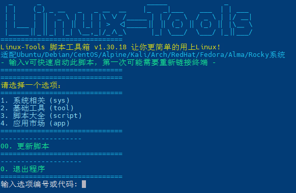

# Linux Tools



## 功能说明

这个脚本提供了一个交互式菜单系统，用于执行各种系统相关的任务和脚本安装。主要功能包括：

1. **系统相关**
   - 更新系统
   - 清理不再需要的软件包
   - 更改系统名
   - 设置快捷键V
   - 设置虚拟内存
   - 设置SSH端口
   - 开放所有端口
   - 设置时区为上海
   - 优化DNS
   - Linux内核优化(高性能/均衡/网站优化模式)
   - 开启root密码登入
   - 开启root密钥登入
   - 自用服务器开箱配置

2. **基础工具**
   - 安装常用工具(curl wget git vim等)
   - 安装Docker
   - 安装开发工具(python java gcc等)
   - 安装网络工具(nmap telnet等)
   - 安装常用数据库
   - 安装Node.js和npm

3. **脚本大全**
   - 安装kejilion脚本
   - 安装勇哥的SB脚本

4. **应用市场**
   - 宝塔面板官方版
   - aaPanel宝塔国际版
   - 1Panel新一代管理面板
   - 安装宝塔开心版
   - 还原宝塔官方版

## linux-tools.sh 脚本信息

### Overview
Linux-Tools 是一个脚本工具箱，旨在简化 Linux 系统的使用。它提供了一个用户友好的界面，用于管理系统任务，并且与广泛的 Linux 发行版兼容。

### Version
当前版本：**1.30.16**

### Compatibility
兼容以下发行版：
- Ubuntu
- Debian
- CentOS
- Alpine
- Kali
- Arch
- RedHat
- Fedora
- Alma
- Rocky

### Installation
脚本会自动更新到 `/usr/local/bin/` 并设置快捷键 `v`。它从 GitHub 存储库获取最新版本，并自动安装更新。

### Usage
- 显示一个美化的工具箱界面，包含版本信息
- 可通过输入 `v` 快速启动
- 支持通过选项编号或代码快速访问功能

### Package Management
脚本自动检测 Linux 发行版，并设置相应的包管理器命令：
- **Debian-based**: apt
- **RedHat-based**: yum
- **Arch-based**: pacman
- **Alpine**: apk

### Features
- 自动更新机制
- 多发行版兼容支持
- 智能包管理
- 系统优化选项
- 服务器安全配置
- 开发环境配置
- 常用工具安装
- 应用市场集成

## 使用方法

要运行此脚本，请执行以下命令：

github 直连版本
```bash
curl -sS -O https://raw.githubusercontent.com/vbskycn/linux-tools/main/linux-tools.sh && chmod +x linux-tools.sh && ./linux-tools.sh
```

github 代理版本
```bash
curl -sS -O https://github.zhoujie218.top/https://raw.githubusercontent.com/vbskycn/linux-tools/main/zh/linux-tools.sh && chmod +x linux-tools.sh && ./linux-tools.sh
```


安装后，您可以通过在终端中输入 `v` 来快速启动脚本。

## 注意事项

1. 某些功能需要root权限
2. 建议在执行重要操作前进行系统备份
3. 内核优化等高级功能请根据实际需求谨慎使用
4. 建议定期更新脚本以获取最新功能和修复
